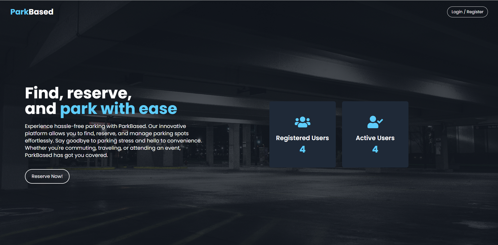
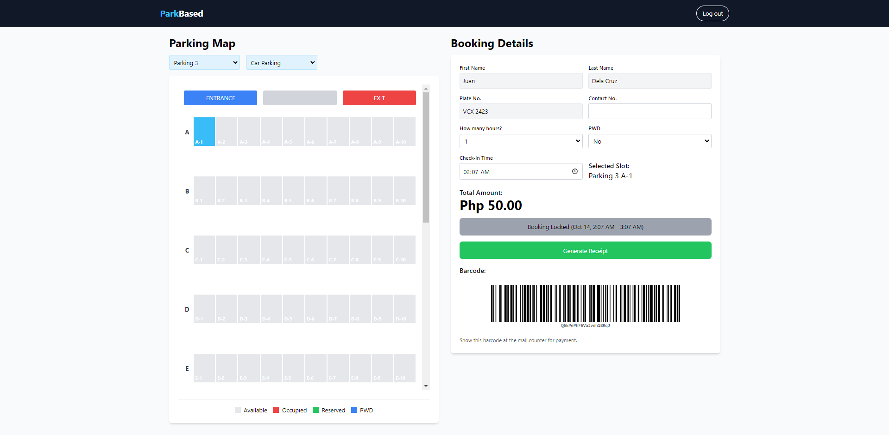
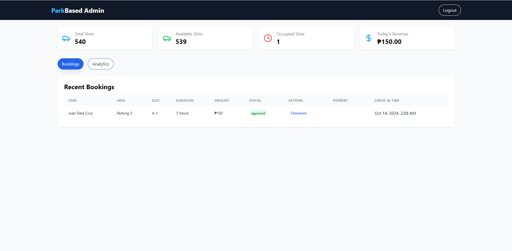

# ParkBased

ParkBased is a web application designed to simplify the parking experience for users. It allows users to find, reserve, and manage parking spots effortlessly. The application provides features for both users and administrators, including booking management, parking slot status updates, and analytics.

## Table of Contents

- [Features](#features)
- [Technologies Used](#technologies-used)
- [Design](#design)
- [Installation](#installation)
- [Usage](#usage)
- [Contributing](#contributing)


## Features

- User registration and authentication
- View and reserve parking slots
- Booking management for users
- Admin dashboard for managing bookings and viewing analytics
- Real-time updates on parking slot availability
- Barcode and QR code generation for booking receipts

## Technologies Used

- **Frontend:** React, Tailwind CSS
- **Backend:** Firebase (Firestore, Authentication)
- **Libraries:** React Router, Recharts (for charts), JsBarcode, QRCode

## Design

The design of ParkBased focuses on user experience and accessibility. Key design principles include:

- **Simplicity:** The user interface is clean and straightforward, allowing users to navigate easily without unnecessary distractions.
- **Responsiveness:** The application is designed to be fully responsive, ensuring a seamless experience across devices, from desktops to mobile phones.
- **Color Scheme:** A modern color palette is used, primarily featuring shades of blue, gray, and white, which enhances readability and provides a calming effect.
- **Typography:** Clear and legible fonts are used throughout the application to ensure that all text is easy to read.

### User Interface Screenshots


*Landing Page*


*User Dashboard*


*Admin Dashboard*

### Design Assets

- Icons: [Lucide Icons](https://lucide.dev/)

## Installation

To run the project locally, follow these steps:

1. Clone the repository:
   ```bash
   git clone https://github.com/yourusername/parkbased.git
   ```

2. Navigate to the project directory:
   ```bash
   cd parkbased
   ```

3. Install the dependencies:
   ```bash
   npm install
   ```

4. Set up your Firebase project and configure the Firebase credentials in the `firebase.js` file.

5. Start the development server:
   ```bash
   npm start
   ```

6. Open your browser and go to `http://localhost:3000`.

## Usage

- **User Registration:** Users can create an account to start reserving parking slots.
- **Booking a Slot:** Users can select a parking area, choose a vehicle type, and reserve a slot.
- **Admin Dashboard:** Admins can manage bookings, view analytics, and update parking slot statuses.

## Contributing

Contributions are welcome! If you have suggestions for improvements or want to report a bug, please open an issue or submit a pull request.

1. Fork the repository.
2. Create your feature branch:
   ```bash
   git checkout -b feature/YourFeature
   ```
3. Commit your changes:
   ```bash
   git commit -m 'Add some feature'
   ```
4. Push to the branch:
   ```bash
   git push origin feature/YourFeature
   ```
5. Open a pull request.

---

Feel free to reach out if you have any questions or need further assistance!
